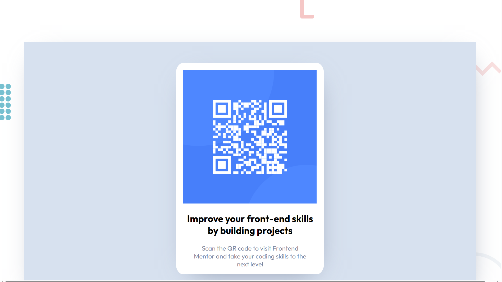

# Frontend Mentor - QR code component solution

This is a solution to the [QR code component challenge on Frontend Mentor](https://www.frontendmentor.io/challenges/qr-code-component-iux_sIO_H). Frontend Mentor challenges help you improve your coding skills by building realistic projects. 

## Table of contents

- [Overview](#overview)
  - [Screenshot](#screenshot)
  - [Links](#links)
- [My process](#my-process)
  - [Built with](#built-with)
  - [What I learned](#what-i-learned)
  - [Continued development](#continued-development)
  - [Useful resources](#useful-resources)
- [Author](#author)

**Note: Delete this note and update the table of contents based on what sections you keep.**

## Overview

### Screenshot



### Links

- Solution URL: [Github repository](https://dmk980.github.io/frontendMentor/tree/main/QR-code-component/)
- Live Site URL: [Live Site](https://qr-code-component-1-indol.vercel.app/)

## My process

I started by understanding the scematics fully then went to the HTML to write up
the skeleton of the project

Once finished i used styles to make it look good then after i was able to focus on the extra 
details like the digrams around the component.

Once done i refined the responsiveness of the text eventhough i tried to build with responsiveness in mind from 
the start.

### Built with

- Semantic HTML5 markup
- CSS custom properties
- Flexbox
- Desktop first approach

**Note: These are just examples. Delete this note and replace the list above with your own choices**

### What I learned

While building this i learned alot about box shadows since ive never really 
used them in any of my projects but ive been facinated with how the turn out 
in the finished product

To see how you can add code snippets, see below:


```css
.qr_component{
    
    box-shadow:10px 30px 100px -50px var(--Colour-3);

}
```

### Continued development

One concept i need to get better at is transform property in css as well 
as mobile first approach since i did desktop first. 

### Useful resources

- [redketchup](https://redketchup.io/color-picker) - This resource was very usefull at getting the colours from the schematics eleviating the need to 
guess which colour to use.

## Author
- Frontend Mentor - [@DMK980](https://www.frontendmentor.io/profile/@DMK980)

