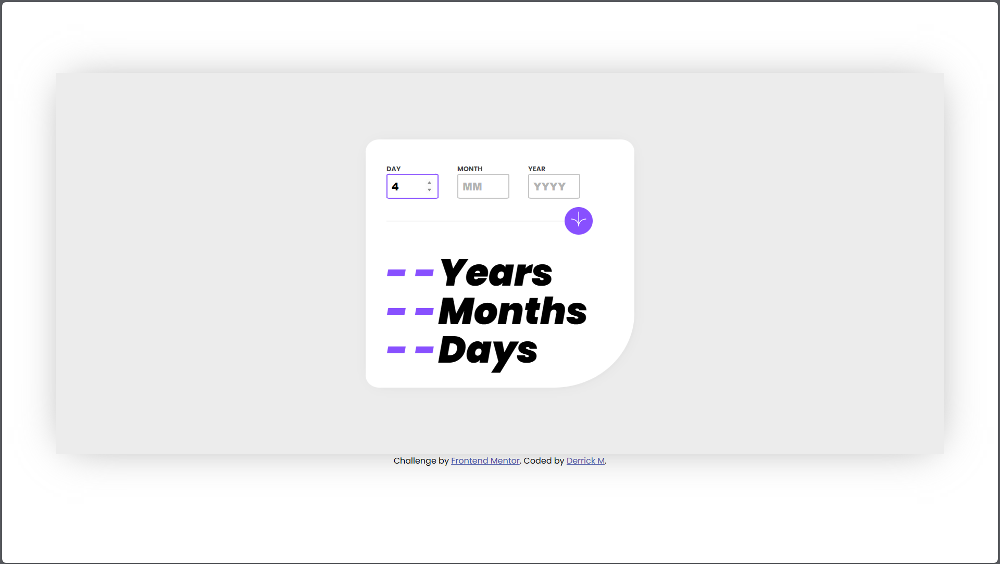

# Frontend Mentor - Age calculator app solution

This is a solution to the [Age calculator app challenge on Frontend Mentor](https://www.frontendmentor.io/challenges/age-calculator-app-dF9DFFpj-Q). Frontend Mentor challenges help you improve your coding skills by building realistic projects. 

## Table of contents

- [Overview](#overview)
  - [The challenge](#the-challenge)
  - [Screenshot](#screenshot)
  - [Links](#links)
- [My process](#my-process)
  - [Built with](#built-with)
  - [What I learned](#what-i-learned)
  - [Continued development](#continued-development)
  - [Useful resources](#useful-resources)
- [Author](#author)


## Overview

### The challenge

Users should be able to:

- View an age in years, months, and days after submitting a valid date through the form
- Receive validation errors if:
  - Any field is empty when the form is submitted
  - The day number is not between 1-31
  - The month number is not between 1-12
  - The year is in the future
  - The date is invalid e.g. 31/04/1991 (there are 30 days in April)
- View the optimal layout for the interface depending on their device's screen size
- See hover and focus states for all interactive elements on the page
- **Bonus**: See the age numbers animate to their final number when the form is submitted

### Screenshot



### Links

- Solution URL Github: [github](https://github.com/DMK980/age-calculator)
- Live Site URL: [vercel](https://age-calculator-five-sandy.vercel.app/)
## My process

My process always starts with understanding the problem at hand fully. 

After that i start with the skeleton of the project and begin writing the html out to have the basic components before jumping to CSS to make it 
look good and similar to the schematics. 

After finishing the CSS most of my time is spent in the logic of the application where i used vanilla javascript. 

It was quite challenging to work out the logic but was a great achivement when i got it working. 

All in all a good challenge
### Built with

- Semantic HTML5 markup
- CSS custom properties
- Flexbox
- Mobile-first workflow
- vanilla Javascript

### What I learned

This challenge was a great learning lesson for the logic side of the application. working with error handling for the first time in a application
was interesting since you have to think of all possible errors and plan for 
what to do for each. 

I also learned alot about working with dates in JS and was shocked by all the little nuances you have to keep in mind. 

Im most proud of the reusable functions that i employed to reduce the amount of lines of code i have to write and simplify the process of debugging the project when needed with an example of one below where the function has one task being to deal with the required input error. 

```js
// required error
const requirederror = (element)=>{
    let reqerror = document.getElementById(`${element}_required_error`)
    let inverror = document.getElementById(`${element}_invalid_error`)
    let error_text = document.createTextNode(`This field is required`)

    if (reqerror === null){
        if (inverror !== null){
            inverror.remove();
        }
        let error_req = document.createElement("p")
        error_req.classList.add("error_color","error_font")
        error_req.id = `${element}_required_error`
        error_req.appendChild(error_text)
        containers[element].appendChild(error_req)
    }
}
```

### Continued development

What i need continued development in is in the javascript side of things 
because i was having a tough time incorporating javascript libraries thats 
why i eneded up using vanilla javascript but if i can leran how to incorporate other libraries the development process could go much faster

### Useful resources

- [Calcuating date difference](https://www.youtube.com/watch?v=NENmT5wCapQ&ab_channel=MindFeeder) - This helped me code the date calculating process which came very handy in the logic required.

## Author

- Frontend Mentor - [@DMK980](https://www.frontendmentor.io/profile/DMK980)
- Github - [@DMK980](https://github.com/DMK980)

